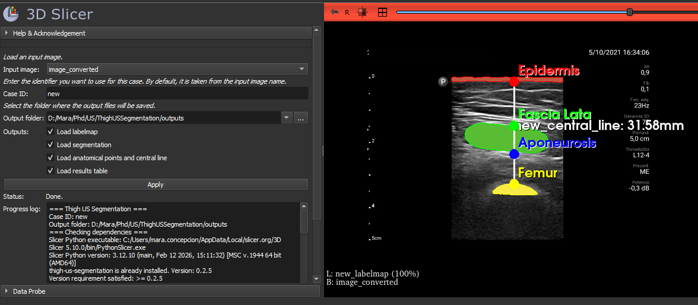

# Thigh US Segmentation

**Thigh US Segmentation** is a 3D Slicer extension for automatic segmentation and quantitative analysis of thigh ultrasound images using a deep learning model based on nnU-Net.

The extension provides a graphical interface in 3D Slicer to run the complete analysis pipeline, visualize the resulting segmentations and anatomical landmarks, and load the quantitative measurements directly into the Slicer scene.

The underlying image-processing and inference pipeline is provided by the Python package `thigh-us-segmentation`.

---

## Features

The extension provides:

- Automatic preprocessing of thigh ultrasound images.
- Automatic segmentation using a trained nnU-Net model.
- Segmentation of:
  - Epidermis
  - Femur
  - Rectus femoris
- Automatic computation of anatomical distances and muscle thickness measurements.
- Generation of anatomical landmarks.
- Generation of a central measurement line.
- Automatic loading of results into 3D Slicer.
- Export of quantitative results to CSV.
- Automatic installation of the required Python package on first use.
- Automatic download of the trained nnU-Net model from Zenodo when the model is not already available locally.

---

## 3D Slicer interface

The module allows the user to:

1. Select an ultrasound image already loaded in 3D Slicer.
2. Define a case ID.
3. Select an output directory.
4. Choose which results should be loaded into the Slicer scene:
   - Labelmap
   - Slicer segmentation
   - Anatomical points and central line
   - Results table
5. Run the complete segmentation and analysis pipeline.

After processing, the selected outputs are automatically loaded into the current 3D Slicer scene.



---

## Workflow

The extension runs the following processing workflow:

```text
Input ultrasound image
        │
        ▼
Image conversion
        │
        ▼
Automatic preprocessing
(active-region detection)
        │
        ▼
nnU-Net inference
        │
        ▼
Thigh structure segmentation
        │
        ▼
Anatomical distance analysis
        │
        ├── Muscle thickness measurements
        ├── Anatomical landmarks
        └── Central measurement line
        │
        ▼
Results loaded into 3D Slicer
```

---

## Requirements

The extension has been tested with:

- **3D Slicer 5.10.0**
- **Python >= 3.10**
- **thigh-us-segmentation >= 0.2.5**
- **nnU-Net v2 2.6.4**

Additional Python dependencies, including OpenCV and nnU-Net, are installed through the `thigh-us-segmentation` Python package.

---

## Installation

### Installation from the 3D Slicer Extension Manager

Once the extension is available in the official 3D Slicer Extensions catalog:

1. Open **3D Slicer**.
2. Open the **Extension Manager**.
3. Search for **ThighUSSegmentation**.
4. Install the extension.
5. Restart 3D Slicer if requested.
6. Open **Thigh US Segmentation** from the **Segmentation** category.

> **Note:** This installation method will become available after the extension is included in the official 3D Slicer Extensions catalog.

### Manual installation for development

To load the extension manually:

1. Clone or download this repository.
2. Open **3D Slicer**.
3. Go to:
   **Edit → Application Settings → Modules**
4. Add the following directory to **Additional module paths**:

```text
ThighUSSegmentation/ThighUSSegmentation
```

5. Restart 3D Slicer.
6. Open **Thigh US Segmentation** from the **Segmentation** category.

---

## First run

The extension uses the `thigh-us-segmentation` Python package to perform preprocessing, inference, and quantitative analysis.

If the package is not available in the Python environment used by 3D Slicer, the extension installs it and its required dependencies using `pip`.

The trained nnU-Net model is distributed separately through Zenodo. If the model is not already available locally, it is downloaded automatically when the pipeline is executed for the first time.

Therefore, an **internet connection is required during the first execution** if the required Python dependencies and/or model weights are not already installed.

The first execution may take several minutes while the required components are installed and downloaded.

---

## Usage

### 1. Load an ultrasound image

Load the thigh ultrasound image into 3D Slicer as a scalar volume.

### 2. Open the module

Open:

```text
Segmentation → Thigh US Segmentation
```

### 3. Select the input

Choose the ultrasound image from the **Input volume** selector.

### 4. Define the case

Specify a **Case ID** for the image.

### 5. Select the output folder

Choose the directory where the generated files should be saved.

### 6. Select the outputs

The user can choose whether to automatically load:

- Labelmap
- Slicer segmentation
- Anatomical points and central line
- Results table

### 7. Run the pipeline

Click **Apply**.

The progress of the pipeline is displayed in the module log.

---

## Outputs

For each processed case, the extension creates a dedicated output directory.

Depending on the available segmentation results, the pipeline can generate:

### Preprocessed image

The ultrasound image after automatic active-region preprocessing.

### Segmentation labelmap

The nnU-Net prediction stored as a medical image labelmap.

The segmentation labels correspond to:

| Label | Structure |
|------:|-----------|
| 1 | Epidermis |
| 2 | Femur |
| 3 | Rectus Femoris |

### 3D Slicer segmentation

A `.seg.nrrd` file containing the segmentation in a format directly compatible with 3D Slicer.

### Anatomical landmarks

Anatomical landmarks are exported as 3D Slicer Markups (`.mrk.json`) when the required structures are successfully detected.

The generated landmarks can include:

- Epidermis
- Fascia lata
- Aponeurosis
- Femur

### Central measurement line

A central line is generated between the epidermis and femur and exported as a 3D Slicer Markup.

### Quantitative results

The pipeline calculates quantitative anatomical measurements, including muscle and tissue thickness measurements.

The results are exported to a CSV file and can also be automatically loaded as a table in 3D Slicer.

If the femur is not detected, thickness measurements that depend on the femur cannot be calculated. In this situation, the available segmentations can still be loaded, while the corresponding anatomical landmarks, central line, and quantitative results are not generated.

---

## Python package

The processing pipeline used by this extension is distributed separately as the Python package:

```text
thigh-us-segmentation
```

It can be installed independently using:

```bash
pip install thigh-us-segmentation
```

The Python API can also be used without 3D Slicer:

```python
from ThighUSSegmentation import run_full_pipeline

result = run_full_pipeline(
    input_image_path="image.dcm",
    output_root="outputs",
    case_id="case001",
)

print(result["df_results"])
```

The 3D Slicer extension provides a graphical interface around this pipeline and automatically loads the generated results into the Slicer scene.

---

## Segmentation model

The extension uses an nnU-Net model trained for automatic segmentation of thigh ultrasound images.

The trained model weights are hosted on Zenodo:

**Mara Concepción Alvarez. (2026). _Thigh Ultrasound Segmentation Model (nnU-Net)_. Zenodo.**

DOI: https://doi.org/10.5281/zenodo.19914473

The model is automatically downloaded when required by the pipeline.

---

## Citation

If you use this software or the associated segmentation model in your research, please cite the model:

> Mara Concepción Alvarez. (2026). *Thigh Ultrasound Segmentation Model (nnU-Net)*. Zenodo.  
> https://doi.org/10.5281/zenodo.19914473

The segmentation framework is based on nnU-Net:

> Isensee, F., Jaeger, P. F., Kohl, S. A. A., Petersen, J., & Maier-Hein, K. H. (2021).  
> *nnU-Net: a self-configuring method for deep learning-based biomedical image segmentation*.  
> Nature Methods, 18, 203–211.  
> https://doi.org/10.1038/s41592-020-01008-z

---

## Contributors

- **Mara Concepción Alvarez** — Universidad Pública de Navarra (UPNA)
- **Paula Crespo Ortega** — Universidad Pública de Navarra (UPNA)
- **Arantxa Villanueva Larre** — Universidad Pública de Navarra (UPNA)
- **Rafael Cabeza Laguna** — Universidad Pública de Navarra (UPNA)

---

## License

The software components and model weights are distributed under separate licenses:

- **3D Slicer extension code:** MIT License
- **`thigh-us-segmentation` Python package code:** MIT License
- **Trained model weights distributed through Zenodo:** Creative Commons Attribution 4.0 International (CC BY 4.0)

See the `LICENSE` file for the license covering the extension source code.

The model weights are distributed separately and are subject to the license specified in the associated Zenodo record.

---

## Acknowledgements

This extension uses **3D Slicer** for medical image visualization and analysis and **nnU-Net** for deep learning-based medical image segmentation.

The segmentation model and associated processing pipeline were developed for automated quantitative analysis of thigh ultrasound images.